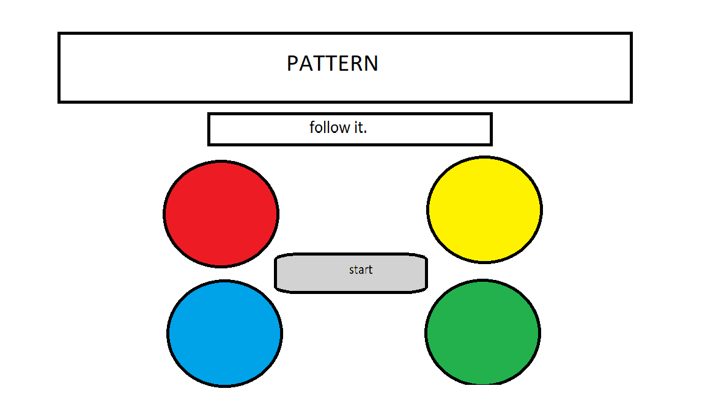

# Pattern

Second Milestone Project for the Web Development course offered by Code Institute. A simple memory game coded with JavaScript.

## Table of Contents
<!-- 1. [UX](#ux)
	- [Project Goals](#project-goals)
	- [User Stories](#user-stories)
	- [Design Choices](#design-choices)
2. [Planning](#planning)
3. [Future Additions](#future-additions)
4. [Testing](#testing)
	- [Bugfixes](#bugfixes)
5. [Deployment](#deployment)
6. [Credit](#credit) -->

**Technologies Used:** HTML5, CSS3, JavaScript; jQuery.

## Planning

### Wireframes

## Testing

<!-- The site has been tested extensively to ensure the best user experience across multiple screen sizes.

- [W3C CSS Validation](https://jigsaw.w3.org/css-validator/#validate_by_input)
- [W3C Markup Validation](https://validator.w3.org/#validate_by_input)

The developer used **W3C CSS Validation Service** and **W3C Markup Validation Service** to check the validity of the website code.

### Testing Process

In order to make sure the site renders acceptably across several screen sizes, I made liberal use of the DevTools offered by Google Chrome (or in my case, the Opera GX browser that closely mimics Chrome) as well as testing load times of each page, mobile and desktop, with the Lighthouse Chrome extension.

### User Stories Testing

As a user of the site, I want: 
- A site and interface that is intuitive, convenient and easy to navigate.
	- Test that all links lead to the proper places (character icons link to correct character pages, as do navbar links).
	- Test that the character icons lighten when the mouse hovers over them.
	- Ensure that the fixed-top navbar isn't clipping down into the main sections in its default position.
- Information that is easy to find and understand, and laid out in a pleasing manner.
	- Ensure that the images and text look acceptable and are spaced well on variable screen sizes.
	- Ensure that all content is centred in easily identifiable sections.
- Additional media (such as character portraits) to give me a better idea of the characters.
	- Test that character images are positioned well on variables screen sizes.
	- Test that stat bars are positioned well on variable screen sizes. -->

### Bugfixes
- **Problem:** There was a mass of unneeded whitespace at the bottom of the page.
	- **Solution:** Initially I had just used divs with relative positioning stacked atop each other, shifting their positions with the ``left`` and ``top`` css attributes. To fix the whitespace issue, I wrapped each 'row' of buttons in a ``container`` div (the ``start`` button has its own ``start-container``) and used ``float: inline-start`` to position them within the rows.
- **Problem:** Found an issue where the new pattern was added to (instead of replacing) the old pattern, and player's new input was being added to the old input.
	- **Solution:** in the ``nextTurn()`` function that handles each new turn, I had not reset both the player's input ``playerInput`` and the current pattern ``currentPat`` properly. I added ``currentPat = [];`` to reset the current pattern.f
	- **Problem:** New pattern still being added to old pattern; new player input still being added to old player input.
		- **Solution:** ``playerInput`` and ``currentPat`` are keys in the ``gameStuff`` object, which I wasn't actually keeping in mind. Changed code to reset ``gameStuff.playerInput`` and ``gameStuff.currentPat``.
- **Problem:** Jest does not recognise jQuery syntax.
	- **Solution:** Stil working on this. Apparently I have to install jQuery separately using ``npm``, which is annoying.