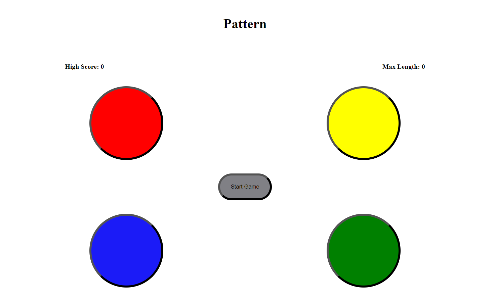
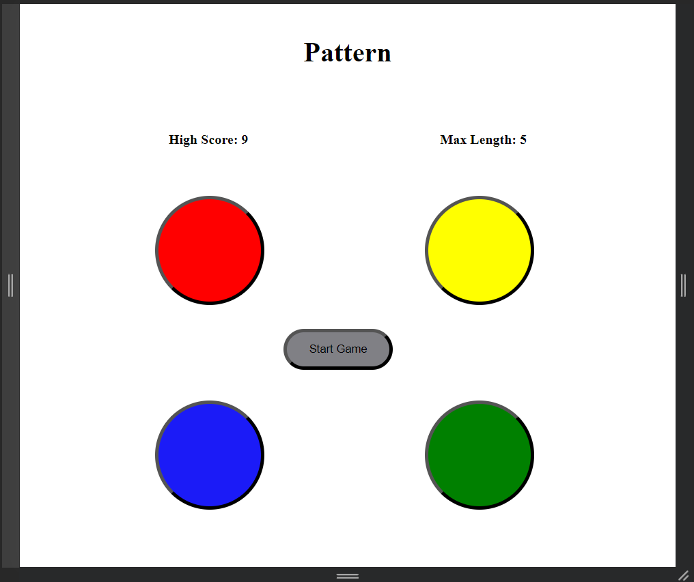
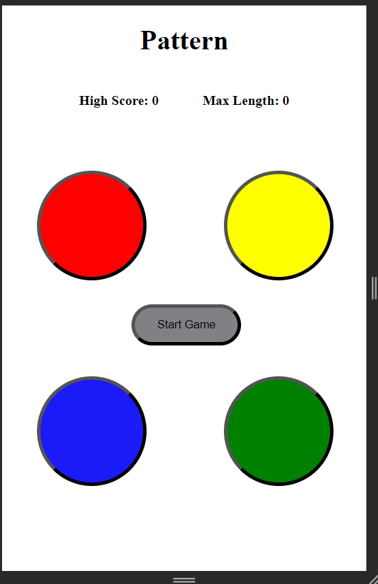
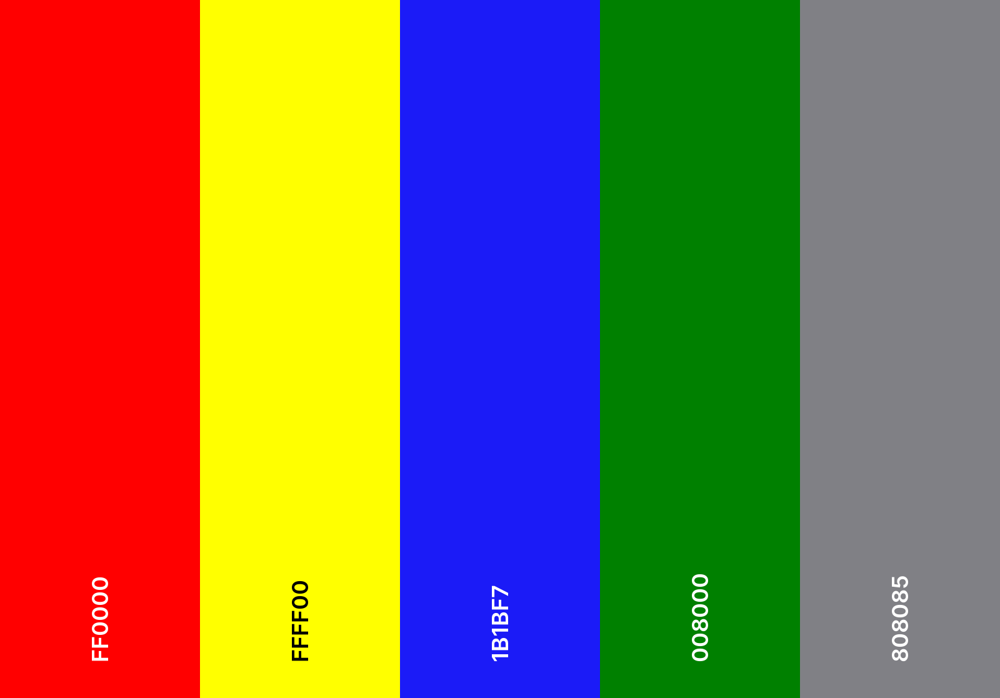
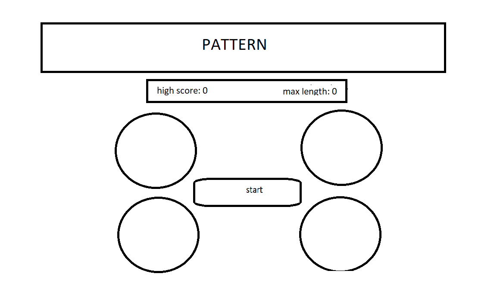

# Pattern

Second Milestone Project for the Web Development course offered by Code Institute. A simple memory game coded with JavaScript.

## Table of Contents
1. [UX](#ux)
	- [Project Goals](#project-goals)
	- [User Goals](#user-goals)
	- [User Stories](#user-stories)
	- [Design Choices](#design-choices)
2. [Planning](#planning)
	- [Wireframes](#wireframes)
3. [Future Additions](#future-additions)
4. [Testing](#testing)
	- [Bugfixes](#bugfixes)
5. [Deployment](#deployment)
6. [Credit](#credit)

**Technologies Used:** HTML5, CSS3, JavaScript.

**Testing Technologies Used:** Jest.

## UX

### Project Goals

This is a simple pattern game in which a pattern flashes across 4 bottons on the screen, which the player must correctly replicate. The length of the pattern and the speed at which the pattern flashes increases as time goes on. If the player does not input the correct sequence, the game ends and they must start over.

### User Goals

- Simple design.
- Visually appealing.
- Interactive controls.
- Intuitive gameplay.

### User Stories

- As a user, I want a functioning game interface.
- As a user, I want an intuitive game interface.
- As a user, I want a game interface that's easy to look at.
- As a user, I want a game whose rules are easy to understand.
- As a user, I want a clear indication of when I have made a mistake.
- As a user, I want a way to track my longest run.

### Design Choices

#### Interface
*Pattern* is built as a simple one-page website consisting of 4 game buttons of different colours and a start button, as well as a high score display and longest pattern display.

The site shifts to accommodate several screen sizes while keeping the same basic layout.

#### Colours

- `#FF0000` is used for the red button.
- `#FFFF00` is used for the yellow button.
- `#1B1BF7` is used for the blue button.
- `#008000` is used for the green button.
- `#808085` is used for the game start button.

## Planning

### Wireframes
I have used MS Paint to sketch out a basic wireframe for the site:

## Future Additions
- A way to change the effective difficulty (speed of flashes and time between flashes)
- A way to adjust the minimum and maximum pattern length
- Possible colour changes for the buttons

## Testing

The site has been tested extensively to ensure the best user experience across multiple screen sizes.

- [W3C CSS Validation](https://jigsaw.w3.org/css-validator/#validate_by_input)
- [W3C Markup Validation](https://validator.w3.org/#validate_by_input)

The developer used **W3C CSS Validation Service** and **W3C Markup Validation Service** to check the validity of the website code. Jest was also used to test core functionalities in and spot errors in the JavaScript code, along with manual testing; ``script.test.js`` contains the tests written for this purpose, and Jest is installed so that these tests can still be run.

### Testing Process

In order to make sure the site renders acceptably across several screen sizes, I made liberal use of the DevTools offered by Google Chrome.

When writing my JavaScript, I used a mix of manual and automated testing; I wrote sections of code and wrote tests for their functionality. This helped me in troubleshooting parts of the code that didn't work as expected. I also manually tested the site to catch errors that I would have missed with pure automated testing. For instance, I discovered the second problem in the Bugfixes section by manually testing the site (this can be attributed to a poor test being written in the first place; this has since been corrected).

### User Stories Testing

As a user of the site, I want: 
- an intuitive game interface.
	- Ensured that buttons respond to being clicked.
	- Ensured that buttons can only be pressed when the pattern isn't being displayed.
- a game interface that's easy to look at.
	- Subjective, but I believe the simple multicoloured buttons set against a white background is easy to look at and keeps player attention on the game itself.
- a game whose rules are easy to understand.
	- The game simply requires that the player click the buttons in the order of the pattern they are shown.
- a clear indication of when I have made a mistake.
	- Tested that game stops when player makes a mistake.
	- Tested that the player is alerted when a mistake has been made and the game is reset properly.
- a way to track my longest run.
	- Tested that high score (longest run) and max pattern length are displayed upon game-over.
	- Tested that worse subsequent runs do not override the high score displays.

<!-- 

 (or in my case, the Opera GX browser that closely mimics Chrome) as well as testing load times of each page, mobile and desktop, with the Lighthouse Chrome extension.

  -->

### Bugfixes
- **Problem:** There was a mass of unneeded whitespace at the bottom of the page.
	- **Solution:** Initially I had just used divs with relative positioning stacked atop each other, shifting their positions with the ``left`` and ``top`` css attributes. To fix the whitespace issue, I wrapped each 'row' of buttons in a ``container`` div (the ``start`` button has its own ``start-container``) and used ``float: inline-start`` to position them within the rows.
- **Problem:** Found an issue where the new pattern was added to (instead of replacing) the old pattern, and player's new input was being added to the old input.
	- **Solution:** in the ``nextTurn()`` function that handles each new turn, I had not reset both the player's input ``playerInput`` and the current pattern ``currentPat`` properly. I added ``currentPat = [];`` to reset the current pattern.f
	- **Problem:** New pattern still being added to old pattern; new player input still being added to old player input.
		- **Solution:** ``playerInput`` and ``currentPat`` are keys in the ``gameStuff`` object, which I wasn't actually keeping in mind. Changed code to reset ``gameStuff.playerInput`` and ``gameStuff.currentPat``.
- **Problem:** The pattern could sometimes be hard to follow visually.
	- **Solution:** I had added a ``:hover`` CSS rule to have the buttons light up when the mouse is over them, but this could get in the way of the actual pattern being displayed. I removed that particular rule, and increased the contrast between buttons lighting up and not (by reducing their opacity further) for good measure.
- **Problem:** The high score and maximum pattern length were not being updated.
	- **Solution:** These are supposed to update once the player has made an error and has to start over. The code that updated these displays was erroneously placed after the ``gameReset`` call, putting relevant stats at 0. Shifting ``gameReset`` to the bottom fixed this issue.

## Deployment
Deploy to GitHub Pages or a similar website hosting and rendering service. The html files can also be opened from local storage (this requires downloading all files in a dedicated folder; this can be done with the git pull command).

To deploy this site to GitHub Pages from [its GitHub repository](https://github.com/cosmicCode42/pattern-MP2), the following steps were taken.

1. Log in to GitHub.
2. From the list of repositories on the screen, select **cosmicCode42/pattern-MP2**. (The above link leads straight to the repository in question.)
3. Select **Settings** from the menu items near the top of the page.
4. From the left sidebar, select **Pages**.
5. Under **Build and Deployment** select **Deploy from a branch** as the Source and **main** as the branch.
6. Page is refreshed and site is being deployed.
7. Scroll down to **GitHub Pages** section again to retrieve the link for the deployed site.

At the moment of submitting the milestone project, the development branch and main branch are identical.

### How to run the project locally

To clone this project from GitHub:

1. Follow this link to [its GitHub repository](https://github.com/cosmicCode42/pattern-MP2).
2. Under the Code dropdown menu in the Code section, you can copy the HTTPS link or download a ZIP.
3. A copied link can be used to make a pull request using Git Bash. 
	1. Change the current working directory to one where you want the clone to be made.
	2. Run ``git init`` to initialise a local repository.
	3. Run ``git remote add origin`` and paste the copied link right after. Running this command sets the GitHub repository as the 'origin'.
	4. Run ``git branch -M main`` if the local repository doesn't have a main branch.
	5. Run ``git pull origin main`` to make the pull request.

### Cloning project into GitPod

To clone this project into GitPod, you will need:
- A [GitHub](https://github.com) account.
- A Chrome browser or compatible browser.

Then follow these steps:
1. Install the [GitPod browser extension for Chrome](https://www.gitpod.io/docs/configure/user-settings/browser-extension).
2. Restart the browser after installation.
3. Log into [GitPod](https://www.gitpod.io) with your GitHub account.
4. Navigate into the [Project GitHub repository](https://github.com/cosmicCode42/pattern-MP2).
5. Click the green **GitPod** button in the top right corner of the repository. This will trigger a new GitPod workspace to be created from the code in GitHub where you can work normally.

## Credit

### Code

Code not written by me and not covered below is attributed to proper sources in comments within the code. All other code is written by me.

#### Guidance and Inspiration

[Simen Daehlin](https://github.com/Eventyret "Simen Daehlin")